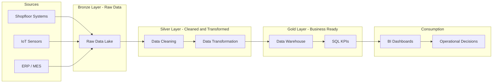

# industrial-digital-twin

<!-- ========================= -->
<!-- PROJECT STATUS -->
<!-- ========================= -->

[](#versioning)
[](#project-status)
[](#license)

---

<!-- ========================= -->
<!-- TECH STACK -->
<!-- ========================= -->

[](https://www.python.org/)
[](https://www.postgresql.org/)
[](https://www.docker.com/)
[](https://www.microsoft.com/power-platform/products/power-bi)

---

<!-- ========================= -->
<!-- ENGINEERING -->
<!-- ========================= -->

[](#testing)
[](#ci-cd)
[](https://black.readthedocs.io/)
[](https://docs.astral.sh/ruff/)
[](#system-architecture)
[](#configuration)

---

<!-- ========================= -->
<!-- DOMAIN -->
<!-- ========================= -->

[](#data-pipeline)
[](#analytics)
    
## 🎯 Project Overview

Short description of the business problem.


## 📚 Table des matières
- [Objectif du projet](#objectif-du-projet)
- [Contexte industriel](#contexte-industriel)
- [Source et nature des données](#source-et-nature-des-données)
- [Principe de mesure de la non-production](#principe-de-mesure-de-la-non-production)
- [Périmètre d’analyse](#périmètre-danalyse)
- [Démarche analytique](#démarche-analytique)
- [Approche données](#approche-données)
- [Couche analytique (Data Warehouse)](#couche-analytique-data-warehouse)
- [Architecture globale](#architecture-globale)
- [Stack technologique](#stack-technologique)
- [KPIs industriels clés](#kpis-industriels-clés)
- [Organisation du repository](#organisation-du-repository)
- [Dashboards Power BI](#dashboards-power-bi)
- [Pipeline](#le-pipeline)
- [Installation](#installation)
- [Organisation du projet](#structure-du-projet)
- [Documentation](#documentation-détaillée)

---

## 🧠 Business Context

- Stakeholders:
- Business Objective:
- Key Decisions to Support:

---

## 🏗 System Architecture


## ⚙️ Technology Stack

| Layer | Tools |
|:---|:---|
| Ingestion & ETL | Python, Pandas |
| Storage & Processing | PostgreSQL, Parquet |
| Analysis & Exploration | Jupyter, NumPy |
| Visualization & BI | Power BI, SQL |
| DevOps & Versioning | Git, GitHub, GitHub Actions |

---

## 📊 Key KPIs

| KPI | Business Definition | Technical Definition |
|-----|---------------------|----------------------|
|     |                     |                      |

---

## 🗂 Data Sources

| Source | Description | Owner |
|--------|------------|-------|
|        |            |       |

---

## 🏗 Project Structure

This project follows a standardized data analytics structure:

- `data/raw` → raw source data  
- `data/processed` → cleaned & transformed data  
- `data/curated` → analytics-ready datasets  
- `sql/` → SQL logic for modeling and analytics  
- `notebooks/` → exploration & analysis  
- `src/digital_twin` → Python business logic  

---

## 🔄 Analytical Workflow

1. Business framing  
2. Data ingestion  
3. Data cleaning  
4. Data modeling  
5. KPI validation  
6. Business analysis  
7. Dashboarding  

---

## ⚠ Assumptions & Limitations

-  

---

## 🚀 Next Steps

-  
## Dashboards Power BI

Les dashboards Power BI sont conçus pour offrir une **lecture claire, synthétique et orientée décision** des performances commerciales.

### Emplacement des fichiers

```text
dashboards/
└── powerbi/
    ├── sales_performance.pbix
    └── screenshots/
```

## Le pipeline

initialise les tables SQL,

charge le staging,

alimente les dimensions,

peuple la table de faits.


## 🚀 Installation
## Installation

### 1️⃣ Clone the repository

```bash
git clone git@github.com:mounkaila-issoufou/industrial-downtime-analytics.gitcd industrial-downtime-analytics
```
### 2️⃣ Create a virtual environment

```bash
```text
python -m venv .venv
```
Activate the environment:

**Windows**

```bash
.\.venv\Scripts\activate
```
**macOS / Linux**

```bash
source .venv/bin/activate
```
### 3️⃣ Install the project (editable mode)

```bash
python -m pip install --upgrade pip
python -m pip install -e .
```
Editable mode (-e) allows local development and CLI usage.

### 🔄 Regenerate dependencies (after updating pyproject.toml)

If you add or modify dependencies in `pyproject.toml`, regenerate the locked `requirements.txt` file with:

```bash
pip install pip-tools
pip-compile pyproject.toml -o requirements.txt
```

This will:

- Resolve all transitive dependencies

- Lock exact versions

- Keep requirements.txt fully synchronized with pyproject.toml

⚠️ Do not edit requirements.txt manually — it is automatically generated.


### 🧱 Database Initialization

Before running the pipeline for the first time:

```bash
digital_twin init
```
This command:

- Creates schemas (stg, ops, dw)

- Creates all staging, operational, and data warehouse tables
## Run pipeline

- Prepares the full database structure

### 🔄 Optional – Reset Data

To truncate all data (without dropping tables):
```bash
digital_twin reset
```
This clears all data layers while keeping the database structure intact.

### ▶ Run the Data Pipeline

To execute the full end-to-end pipeline:
```bash
digital_twin run
```
or

```bash
python -m digital_twin.cli run
```
- The pipeline performs:

- Mock industrial data generation

- Staging layer load

- Operational layer transformation

- Data warehouse population

### 🔁 Full Refresh (Reset + Run)

For a complete refresh:

```bash
digital_twin full-refresh
```
## 🏗 Execution Flow Overview

```bash
init         → Create schemas & tables
reset        → Truncate data layers
run          → Execute full DML pipeline
full-refresh → Reset + Run
```

### 🧹 Pre-commit hooks (Automatic code checks)

We use `pre-commit` to ensure code quality and consistent formatting before committing. It automatically runs tools like **black** (code formatter) and **ruff** (linter) on your modified files.

#### 1️⃣ Install pre-commit

```bash
pip install pre-commit
```
#### 2️⃣ Add the configuration file

Create a ``.pre-commit-config.yaml`` at the root of your project:

```bash
repos:
  - repo: https://github.com/psf/black
    rev: 24.0
    hooks:
      - id: black

  - repo: https://github.com/charliermarsh/ruff-pre-commit
    rev: v0.0.326
    hooks:
      - id: ruff
```
#### 3️⃣ Activate pre-commit hooks

```bash
pre-commit install
```

This installs the Git hook. From now on, every git commit will automatically check your code.

#### 4️⃣ Usage

Simply work as usual and commit your changes:

```bash
git add .
git commit -m "feat: add new feature"
```

Pre-commit will check and format modified files automatically.

If issues are found, fix them and commit again.

### 5️⃣ Optional: run on all files

To apply hooks to all files in the project (useful when first setting up):

```bash
pre-commit run --all-files

```

## Résultats attendus


---

## Documentation détaillée

La documentation fonctionnelle et technique du projet est centralisée dans le dossier `docs/` :

- **Architecture globale**  
  👉 [`docs/architecture_overview.md`](docs/architecture_overview.md)

- **Modèle de données (Star Schema)**  
  👉 [`docs/data_model.md`](docs/data_model.md)

- **Dictionnaire de données**  
  👉 [`docs/data_dictionary.md`](docs/data_dictionary.md)

- **Définition des KPI métier**  
  👉 [`docs/kpi_definitions.md`](docs/kpi_definitions.md)

- **Hypothèses, périmètre et limites du projet**  
  👉 [`docs/assumptions_and_limits.md`](docs/assumptions_and_limits.md)


## ⚠️ Limites


---

## 👤 Auteur
Projet de portfolio **Data Analyst senior** – Abdoul Mounkaila Issoufou

## Contact & Liens

[](https://www.linkedin.com/in/abdoul-m-3a76b5214/)
[](https://github.com/mounkaila-issoufou)
[](mailto:mounkaila.issoufou025@gmail.com)


## Licence

Ce projet est sous licence **MIT** – libre d’utilisation à des fins éducatives et professionnelles.

